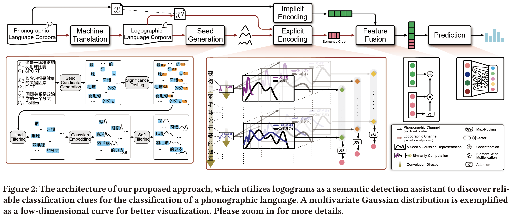

# Leco

This the the repository for the SIGIR 2020 paper "[***Enhancing Text Classification via Discovering Additional Semantic Clues from Logograms***](https://dl.acm.org/doi/abs/10.1145/3397271.3401107)".

By leveraging the cross-linguistic variation of two types of writing systems, Leco utilizes logograms to capture reliable clues for the text classification of phonographic languages, especially for low-resource ones.


## Overview

- code/ 
  contains the source codes (Leco Classifier and Gaussian Embedding).
- data/ 
  contains example datasets used for evaluating.

### Reqirements:

* Python (≥3.0)
* PyTorch (≥1.0)
* [BERT-Base](https://github.com/google-research/bert): Please initialize a pretrained BERT model (self.bert in class TextEmbedding) to obtain BERT embeddings.
* Hyperparameters are in _public.py.

### Citation

If you find this study helpful or related, please kindly consider citing as:

```
@inproceedings{Leco,
  title = {Enhancing Text Classification via Discovering Additional Semantic Clues from Logograms},
  author = {Chen Qian and Fuli Feng and Lijie Wen and Li Lin and Tat-Seng Chua},
  booktitle = {Proceedings of the 43rd International ACM SIGIR Conference on Research and Development in Information Retrieval (SIGIR'20)},
  year = {2020},
  pages = {1201–1210}
}
```
